# Implement Command Dependency Diagram (Unified Planner)

Field-level dependency diagram for `pika agent implement --project-root <path>` **without** `--dry-run`. Each node is a field or value; edges show where each value is sourced from.

## Top-level attributes summary

### Inputs

| File | Top-level attributes |
|------|----------------------|
| **config.yaml** | `version`, `project`, `agent`, `prompts`, `schemas`, `commands`, `id_generation`, `csv_contracts`, `logging` — implement uses `commands.implement.inputs`, `commands.implement.budgets`, `commands.implement.type_placement_path`, `commands.implement.forbidden_paths`, `commands.implement.verification_commands` |
| **design_spec.csv** (DESIGN-SPEC.csv) | `spec_id`, `module_tag`, `module_role`, `subunit`, `title`, `requirement`, `acceptance_criteria`, `implementation_status`, `mapped_code_symbols`, `mapped_confidence`, `mapped_consistency_score`, `mapped_problems`, `index_status`, `assumptions`, `last_indexed_at`, `mapped_test_cases`, `map_status`, `map_assumptions`, `mapped_at` |
| **PROJECT_CONTEXT.md** | Free-form markdown; project context for agents |
| **codebase** | Source tree under `codebase_dir` (e.g. `src/` or `.`) |
| **RuntimeContext** | `run_id`, `dry_run`, `project_root` |

### Intermediate (run-scoped)

| File | Top-level attributes |
|------|----------------------|
| **run_meta.json** | `command`, `run_id`, `dry_run`, `budgets`, `type_placement_path`, `config_hash` |
| **workset.json** | `selected` — array of `{spec_id, module_tag, module_role}` |
| **module_catalog.json** | `modules` — array of `{module_tag, module_role, root_dirs, languages}` |
| **unified_plan.json** | `module_plans`, `spec_dependencies`, `shared_contracts` — single unified planner agent output |
| **module_plans/{M}.json** | Per-module file plans extracted from unified_plan (for debugging) |
| **plan_validation.json** | `status`, `checks`, `reasons` — DAG acyclicity, spec coverage, module coverage |
| **batch_plan.json** | `batches` — array of `{batch_id, kind, spec_ids, module_tags, depends_on_batches, rationale, budgets_applied}` |
| **batch_plan_validation.json** | `status`, `checks`, `reasons` |
| **batch_briefs/B{N}.json** | `batch_id`, `spec_rows`, `planned_anchors`, `shared_contracts`, `spec_dependency_context`, `constraints` |
| **agent_outputs/implement_{B}.json** | `run_summary`, plus spec-keyed `{spec_id}` objects with `summary`, `diffs`, `mapped_classes_functions`, `mapped_test_cases` |

### Outputs

| File | Top-level attributes |
|------|----------------------|
| **summary.json** | `status`, `dry_run` (optional) |
| **trace/trace.jsonl** | One JSON object per line: `run_id`, `batch_id`, `spec_ids`, `diff_sha256`, `before_hashes`, `after_hashes`, `verification`, `artifacts` |
| **patches/*.diff** | Unified diff content; copied from `implement_{B}.{spec_id}.diffs[].diff_path` |
| **DESIGN-SPEC.csv** | Updated `mapped_code_symbols`, `mapped_test_cases` (and optionally `implementation_status`) |
| **test_spec.csv** | `test_id`, `framework`, `test_file`, `test_case` — deduplicated from implement outputs |
| **codebase** | Modified files via `git apply` of patches |

### Agent artifacts (per-run, transient)

| Path | Description |
|------|-------------|
| **agent_artifacts/implement/{run_id}/local_output.json** | Agent raw output (unified_planner); overwritten per invoke |
| **agent_artifacts/implement/{run_id}/*.diff** | Unified diffs written by implement agent; referenced by `diff_path` in implement output |

## Mermaid diagram

```mermaid
flowchart TB
    subgraph INPUTS["Inputs"]
        cfg["config.yaml"]
        ds["design_spec.csv"]
        pc["PROJECT_CONTEXT.md"]
        cb["codebase"]
        ctx["RuntimeContext"]
    end

    subgraph RUN_META["run_meta.json"]
        rm_command["command = implement"]
        rm_run_id["run_id ← ctx.run_id"]
        rm_dry["dry_run ← ctx.dry_run"]
        rm_budgets["budgets ← config.implement.budgets"]
        rm_type_placement["type_placement_path ← config"]
        rm_config_hash["config_hash ← sha256 config"]
    end

    subgraph WORKSET["workset.json"]
        ws_spec["selected[].spec_id ← design_spec"]
        ws_tag["selected[].module_tag ← design_spec"]
        ws_role["selected[].module_role ← design_spec"]
    end

    subgraph MOD_CAT["module_catalog.json"]
        mc_tag["modules[].module_tag ← workset"]
        mc_role["modules[].module_role ← workset"]
        mc_dirs["modules[].root_dirs ← codebase scan"]
    end

    subgraph UP["unified_plan.json"]
        up_mp["module_plans ← agent from full design spec + catalog"]
        up_deps["spec_dependencies ← agent: cross-module spec-to-spec deps"]
        up_sc["shared_contracts ← agent: canonical DTOs/types"]
    end

    subgraph PV["plan_validation.json"]
        pv_status["status ← validate DAG + spec coverage + module coverage"]
        pv_checks["checks ← acyclicity, all_specs_covered, refs_valid, all_modules"]
        pv_reasons["reasons ← validation failures"]
    end

    subgraph BP["batch_plan.json"]
        bp_batches["batches[].batch_id, kind, spec_ids, module_tags"]
        bp_deps["batches[].depends_on_batches ← spec-level dependency graph"]
        bp_chunk["chunking ← max_specs_per_batch + max_files"]
        bp_budgets["batches[].budgets_applied ← config.budgets"]
    end

    subgraph BV["batch_plan_validation.json"]
        bv_status["status ← validate batch deps + spec uniqueness"]
        bv_checks["checks ← dependency paths, batch refs"]
        bv_reasons["reasons ← validation failures"]
    end

    subgraph BB["batch_briefs/B{N}.json"]
        bb_id["batch_id ← batch_plan"]
        bb_specs["spec_rows ← workset by spec_ids"]
        bb_anchors["planned_anchors ← module_plans filtered by spec_ids"]
        bb_sc["shared_contracts ← filtered by consumed_by_specs"]
        bb_dep_ctx["spec_dependency_context ← spec_deps for batch specs"]
        bb_validate["validation ← raise if file count > max_files"]
        bb_const["constraints ← forbidden_paths + budgets + verify_cmds"]
    end

    subgraph IO["implement_{B}.json"]
        io_summary["run_summary ← agent"]
        io_diffs["{spec_id}.diffs ← agent writes to agent_artifacts"]
        io_mapped["{spec_id}.mapped_classes_functions ← agent"]
        io_tests["{spec_id}.mapped_test_cases ← agent"]
    end

    subgraph PATCHES["patches/*.diff"]
        patch["content ← copy from diffs[].diff_path"]
    end

    subgraph TRACE["trace.jsonl"]
        tr_run["run_id ← ctx.run_id"]
        tr_batch["batch_id ← brief.batch_id"]
        tr_specs["spec_ids ← implement output keys"]
        tr_sha["diff_sha256 ← sha256 patches"]
        tr_before["before_hashes ← codebase pre-apply"]
        tr_after["after_hashes ← codebase post-apply"]
        tr_verify["verification ← verification_commands output"]
    end

    subgraph SUMMARY["summary.json"]
        sum_status["status ← completed | failed"]
        sum_dry["dry_run ← ctx.dry_run"]
    end

    subgraph OUT["Outputs"]
        dso["DESIGN-SPEC.mapped_code_symbols"]
        dso_t["DESIGN-SPEC.mapped_test_cases"]
        ts["test_spec.csv"]
        code["codebase ← git apply patches"]
    end

    ds --> ws_spec
    ds --> ws_tag
    ds --> ws_role
    ctx --> rm_run_id
    ctx --> rm_dry
    cfg --> rm_budgets
    cfg --> rm_type_placement
    cfg --> rm_config_hash

    ws_spec --> mc_tag
    ws_tag --> mc_tag
    ws_role --> mc_role

    ds --> up_mp
    mc_tag --> up_mp
    pc --> up_mp
    pc --> up_deps
    pc --> up_sc

    up_mp --> pv_status
    up_deps --> pv_status

    up_deps --> bp_deps
    up_mp --> bp_chunk
    cfg --> bp_budgets
    cfg --> bp_chunk

    bp_batches --> bv_status
    bp_deps --> bv_status

    bp_batches --> bb_specs
    up_mp --> bb_anchors
    up_sc --> bb_sc
    up_deps --> bb_dep_ctx
    cfg --> bb_const

    bb_specs --> io_diffs
    bb_anchors --> io_diffs
    cb --> io_diffs
    bb_const --> io_diffs

    io_diffs --> patch
    patch --> tr_sha
    cb --> tr_before
    patch --> code
    code --> tr_after
    ctx --> tr_run
    bb_id --> tr_batch

    io_mapped --> dso
    io_tests --> dso_t
    io_tests --> ts
    ctx --> sum_dry
```

## Field-level dependency table

| Target file | Field | Source |
|-------------|-------|--------|
| **run_meta.json** | command | literal `"implement"` |
| | run_id | `ctx.run_id` |
| | dry_run | `ctx.dry_run` |
| | budgets | `config.commands.implement.budgets` |
| | type_placement_path | `config.commands.implement.type_placement_path` |
| | config_hash | `sha256(json.dumps(config))` |
| **workset.json** | selected[].spec_id | `design_spec.row.spec_id` (where implementation_status != Completed) |
| | selected[].module_tag | `design_spec.row.module_tag` |
| | selected[].module_role | `design_spec.row.module_role` |
| **module_catalog.json** | modules[].module_tag | `workset.group_by(module_tag)` |
| | modules[].module_role | `workset.group_by(module_tag)` |
| | modules[].root_dirs | codebase scan or `["{module_tag}/"]` |
| | modules[].languages | `[]` |
| **unified_plan.json** | module_plans | agent (from full design spec CSV + module_catalog + project_context) |
| | module_plans[].planned_anchors | agent: file paths, symbols, anchor kinds, spec_ids |
| | module_plans[].intra_module_dependencies | agent: within-module spec ordering |
| | spec_dependencies | agent: cross-module spec-to-spec edges with rationale |
| | shared_contracts | agent: canonical DTOs/interfaces with owning_module, planned_file_path, consumed_by_specs |
| **plan_validation.json** | status | `_validate_unified_plan(plan, all_spec_ids, module_catalog)` |
| | checks | all_specs_covered, spec_dependencies_acyclic, spec_dependency_refs_valid, all_modules_planned |
| | reasons | validation failures |
| **batch_plan.json** | batches[].batch_id | derived (B0, B1, ...) |
| | batches[].kind | `module_impl` |
| | batches[].spec_ids | deterministic chunking: max_specs_per_batch + max_files (greedy file-aware bin-packing) |
| | batches[].module_tags | from module/SCC ordering |
| | batches[].depends_on_batches | spec-level: only provider batches whose specs the chunk actually needs |
| | batches[].rationale | derived (e.g. "provider-first CORE") |
| | batches[].budgets_applied | `config.commands.implement.budgets` |
| **batch_plan_validation.json** | status | `_validate_batch_plan_dependencies(batch_plan, spec_dependencies)` |
| | checks | dependency_ids_exist, spec_ids_unique_across_batches, provider_dependency_paths_ok |
| | reasons | validation failures |
| **batch_briefs/B{N}.json** | batch_id | `batch_plan.batches[].batch_id` |
| | spec_rows | `workset.by_spec(spec_ids)` (full design_spec rows) |
| | planned_anchors | `module_plans[module].planned_anchors` filtered by `anchor.spec_ids ∩ batch.spec_ids` |
| | shared_contracts | `unified_plan.shared_contracts` filtered by `consumed_by_specs ∩ batch.spec_ids` |
| | spec_dependency_context | `spec_dependencies` filtered to batch consumer specs |
| | (validation) | raises `ValueError` if unique `planned_file_path` count exceeds `max_files` |
| | constraints | `{forbidden_paths, budgets_applied, verification_commands, traceability_rules}` from config |
| **implement_{batch}.json** | run_summary | agent `{status, notes}` |
| | {spec_id}.summary | agent |
| | {spec_id}.diffs[] | agent: `diff_id`, `diff_path`, `touched_files`, `verification_notes` |
| | {spec_id}.mapped_classes_functions | agent |
| | {spec_id}.mapped_test_cases | agent |
| **patches/*.diff** | content | copy from `implement_{batch}.{spec_id}.diffs[].diff_path` |
| **trace/trace.jsonl** | run_id | `ctx.run_id` |
| | batch_id | `brief.batch_id` |
| | spec_ids | `implement_output` keys (sorted) |
| | diff_sha256 | `sha256(patches)` |
| | before_hashes | `sha256(codebase)` pre-apply |
| | after_hashes | `sha256(codebase)` post-apply |
| | verification | `verification_commands` output records |
| | artifacts | `[{kind: "patch", ref: "patches/{name}"}]` |
| **summary.json** | status | `"completed"` or `"failed"` |
| | dry_run | `ctx.dry_run` (optional) |
| **DESIGN-SPEC.csv** | row.mapped_code_symbols | `implement_output[spec_id].mapped_classes_functions[].qualified_name` |
| | row.mapped_test_cases | `implement_output[spec_id].mapped_test_cases` -> test_id |
| **test_spec.csv** | test_id | `T{N}` (next from existing or new) |
| | framework, test_file, test_case | `implement_output[spec_id].mapped_test_cases[]` |
| **Code repository** | modified files | `git apply patches/*.diff` |

## Path resolution (defaults)

- `design_spec_path`: `commands.implement.inputs.design_spec_path` or `project.state.design_spec_path` -> e.g. `state/DESIGN-SPEC.csv`
- `agent_runs_dir`: `out/agent_runs`
- `agent_artifacts_dir`: `out/agent_artifacts`
- `log_dir`: `logging.log_dir` or `out/logs`
- `test_spec_path`: `commands.implement.test_spec_path` -> `out/state/test_spec.csv`
- `backups_dir`: `out/backups`
